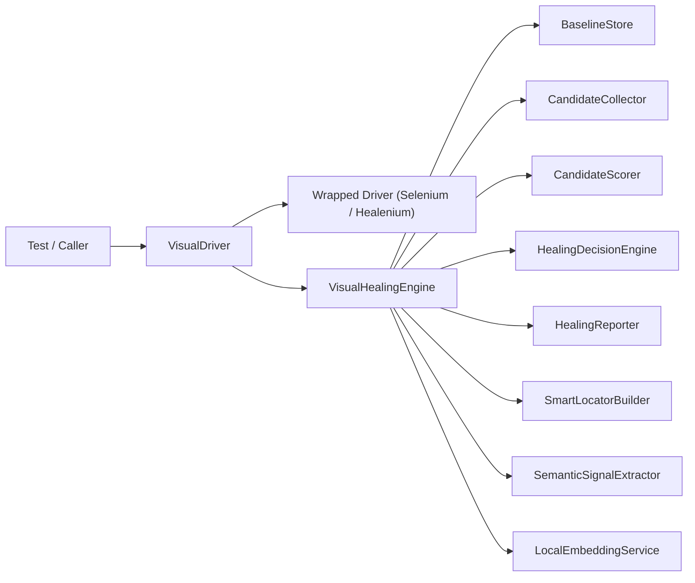

# Architecture

## Overview

Xealenium has three recovery layers:

1. Selenium
2. Healenium
3. Xealenium visual healing

The third layer exists for hard DOM drift, where the original selector shape is no longer trustworthy enough to preserve.

## Component Diagram



## Public API

The intended public entry points are:

- [`VisualDriver.java`](src/main/java/com/visual/driver/VisualDriver.java)
- [`VisualHealingEngine.java`](src/main/java/com/visual/engine/VisualHealingEngine.java)
- [`VisualHealingConfig.java`](src/main/java/com/visual/config/VisualHealingConfig.java)
- [`EmbeddingConfig.java`](src/main/java/com/visual/config/EmbeddingConfig.java)

System properties still work as a compatibility path, but config objects are now the preferred runtime API.

## Package Structure

- `com.visual.driver`
  - driver wrapper and user-facing entry point
- `com.visual.engine`
  - orchestration, candidate collection, scoring, review, and reporting coordination
- `com.visual.semantic`
  - DOM and AX semantic providers plus lexical similarity
- `com.visual.locator`
  - smart locator generation and selector ranking
- `com.visual.baseline`
  - snapshot persistence and page identity lookup
- `com.visual.embedding`
  - local ONNX embedding runtime and fingerprint construction
- `com.visual.report`
  - heatmaps and HTML report artifacts
- `com.visual.image`
  - screenshot and image utilities
- `com.visual.model`
  - typed models shared across engine layers
- `com.visual.config`
  - runtime configuration objects

## Main Runtime Flow

```text
findElement(By...)
  -> Selenium lookup
  -> Healenium lookup
  -> VisualDriver fallback
  -> VisualHealingEngine.heal(...)
  -> baseline lookup
  -> candidate collection
  -> semantic enrichment
  -> field assignment
  -> candidate scoring
  -> review strategy decision
  -> smart locator generation
  -> heatmap + report
```

## VisualHealingEngine

[`VisualHealingEngine.java`](src/main/java/com/visual/engine/VisualHealingEngine.java) is now a facade-orchestrator instead of a god class.

It coordinates:

- baseline capture
- baseline lookup
- candidate collection
- field assignment
- scoring
- review strategy selection
- report generation

It no longer owns all of those implementations directly.

## Engine Components

### Baseline capture

- [`BaselineCaptureService.java`](src/main/java/com/visual/engine/BaselineCaptureService.java)
- [`BaselineStore.java`](src/main/java/com/visual/baseline/BaselineStore.java)
- [`PageIdentityService.java`](src/main/java/com/visual/baseline/PageIdentityService.java)

### Candidate collection and metadata

- [`CandidateCollector.java`](src/main/java/com/visual/engine/CandidateCollector.java)
- [`CandidateMetadataCollector.java`](src/main/java/com/visual/engine/CandidateMetadataCollector.java)

### Scoring and assignment

- [`FieldAssignmentEngine.java`](src/main/java/com/visual/engine/FieldAssignmentEngine.java)
- [`CandidateScorer.java`](src/main/java/com/visual/engine/CandidateScorer.java)
- [`HealingDecisionEngine.java`](src/main/java/com/visual/engine/HealingDecisionEngine.java)

### Review strategies

- [`ThresholdOnlyReviewStrategy.java`](src/main/java/com/visual/engine/ThresholdOnlyReviewStrategy.java)
- [`AutoAcceptReviewStrategy.java`](src/main/java/com/visual/engine/AutoAcceptReviewStrategy.java)
- [`SwingReviewStrategy.java`](src/main/java/com/visual/engine/SwingReviewStrategy.java)

### Reporting

- [`HealingReporter.java`](src/main/java/com/visual/engine/HealingReporter.java)
- [`HeatmapRenderer.java`](src/main/java/com/visual/report/HeatmapRenderer.java)

## Semantic Layer

The semantic layer is shared by both the healer and the locator builder.

Core classes:

- [`DomSemanticProvider.java`](src/main/java/com/visual/semantic/DomSemanticProvider.java)
- [`AccessibilityTreeSemanticProvider.java`](src/main/java/com/visual/semantic/AccessibilityTreeSemanticProvider.java)
- [`SemanticSignalExtractor.java`](src/main/java/com/visual/semantic/SemanticSignalExtractor.java)
- [`BrowserSemanticScripts.java`](src/main/java/com/visual/semantic/BrowserSemanticScripts.java)

Signals include:

- accessible name
- semantic role
- autocomplete
- label text
- placeholder
- description text
- section context
- parent context
- input type

This shared pipeline is the single source of truth for DOM and semantic extraction.

## Locator Layer

[`SmartLocatorBuilder.java`](src/main/java/com/visual/locator/SmartLocatorBuilder.java) is responsible for:

- element normalization from points or nested wrappers
- candidate selector generation
- selector validation
- readability and stability ranking

It does not own healing decisions.

## Embedding Layer

[`EmbeddingFingerprintBuilder.java`](src/main/java/com/visual/embedding/EmbeddingFingerprintBuilder.java) builds the semantic fingerprint.

[`LocalEmbeddingService.java`](src/main/java/com/visual/embedding/LocalEmbeddingService.java) loads the local ONNX model and computes embeddings when enabled.

The embedding layer is isolated from reporting and UI.

## Reports And Artifacts

Xealenium keeps local artifacts for debugging and review:

- `visual-baseline.json`
- `visual-heatmap-*.png`
- `visual-healing-report.html`

Heatmaps are rendered against full-page stitched screenshots using page coordinates, which keeps lower-page overlays aligned after scroll.

## Benchmarks

Benchmark suites live in `src/test/java/com/demo/benchmark` and are intentionally separate from framework unit tests.

They prove four claims:

- direct Selenium still works where nothing important changed
- Healenium can recover soft drift
- Xealenium can recover harder semantic and structural drift
- Xealenium can refuse unsafe guesses

See [`TEST_MATRIX.md`](docs/TEST_MATRIX.md) for the scenario catalog.
